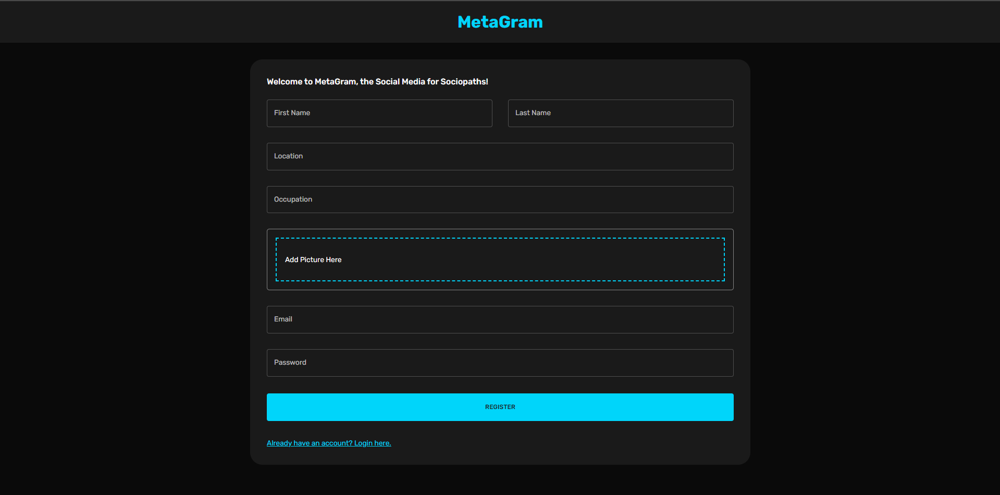
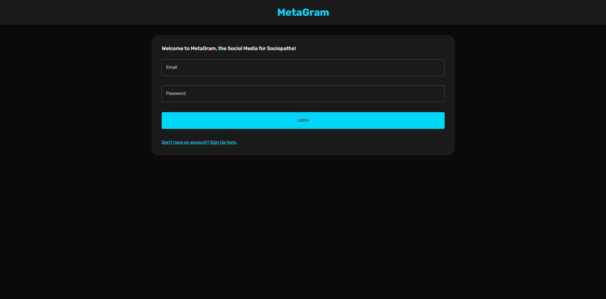
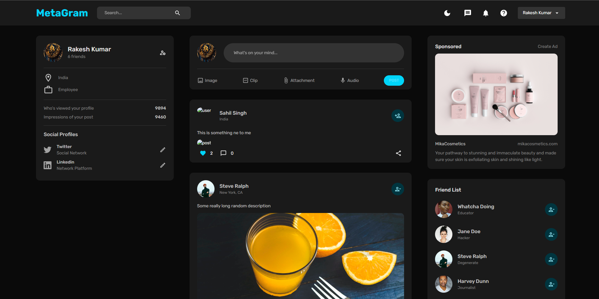
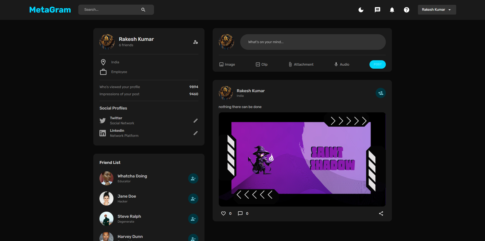
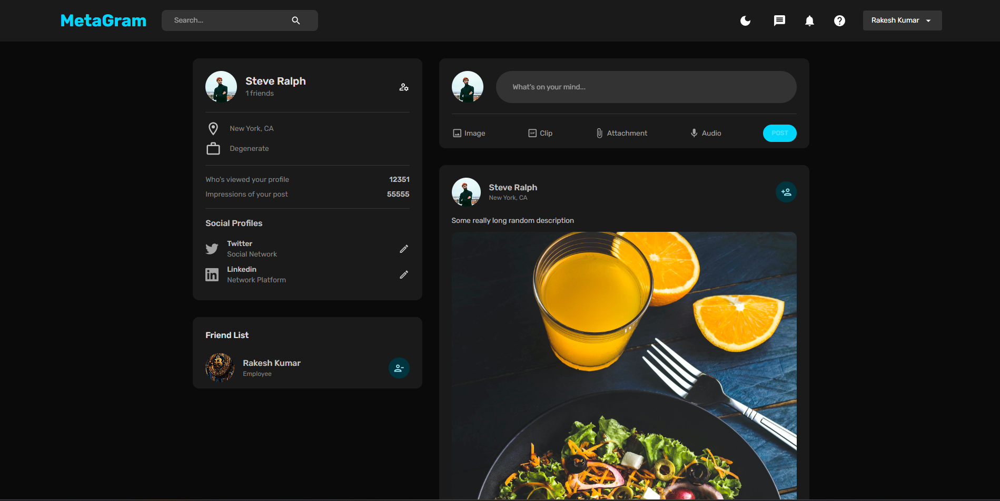
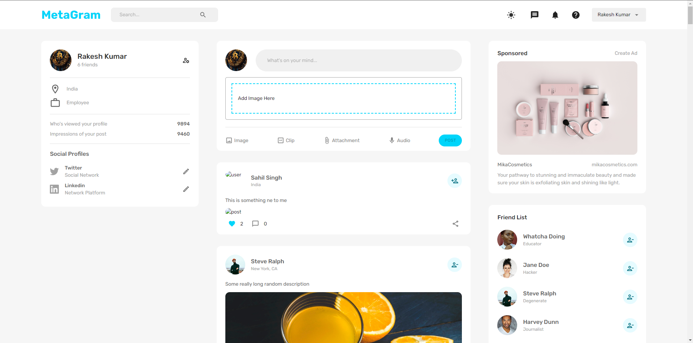

<div align="center">
  

  <div>
    
      
      
      
      
      
  </div>


  <div>
    
    
    
    
  </div>

  <h3 align="center">A food delivery web application </h3>

   
</div>

## 📋 <a name="table">Table of Contents</a>

1. 🤖 [Introduction](#introduction)
2. ⚙️ [Tech Stack](#tech-stack)
3. 🔋 [Features](#features)
4. 🤸 [Quick Start](#quick-start)
5. 🕸️ [Snippets (Code to Copy)](#snippets)


## <a name="introduction">🤖 Introduction</a>

Built with React.Js, Node.js, Express.Js and MongoDB, a food delivery app with the features of adding removing itmes from your cart, checkout your orders from my-order section, easy to login and signup functionality.


## <a name="tech-stack">⚙️ Tech Stack</a>

- React.Js
- Node.Js
- Express.Js
- MongoDb


## <a name="features">🔋 Features</a>

### Features of GoFood-Food delivery Application project


👉 **Home Page**: Listed with three categories of food items which Starter, Biriyani and Pizza with a search filed feature.
  
👉 **Sign-Up Page**: Easy to signup by providing your name, email, password and location.

👉 **Sign-In Page**: Easy to signin by providing you email, password.

👉 **MyCart Page**: After adding your desire food items with desire quantity (half or full) you can go to my-cart section to see the total pricing and all the items you have ordered.

👉 **MyOrder Page**: After checking out from the my-cart section, you can redirect to my-order section that indicataed that your order have been placed.


## <a name="quick-start">🤸 Quick Start</a>

Follow these steps to set up the project locally on your machine.

**Prerequisites**

Make sure you have the following installed on your machine:

- [Git](https://git-scm.com/)
- [Node.js](https://nodejs.org/en)
- [npm](https://www.npmjs.com/) (Node Package Manager)
- [nodemon](https://nodemon.io/) (Server running side)

**Cloning the Repository**

```bash
git clone https://github.com/Sahil-2703/GoFood.git
cd GoFood
```

**Installation**

Install the project dependencies using npm:

```bash
npm install
```

For Server:-

```bash
cd backend 
npm install
```


**Running the Project**

```bash
npm start
```

For Server:-

```bash
nodemon index.js
```

Open [http://localhost:3000](http://localhost:3000) in your browser to view the project.

## <a name="snippets">🕸️ Snippets</a>

<details>
<summary><code>FoodCategory</code></summary>

```json
[
    {
        "CategoryName": "Biryani/Rice"
    },
    {
        "CategoryName": "Starter"
    },
    {
        "CategoryName": "Pizza"
    }
]
```

</details>

<details>
<summary><code>FoodData</code></summary>

```json
[
    {
        "CategoryName": "Biryani/Rice",
        "name": "Chicken Fried Rice",
        "img": "https://images.unsplash.com/photo-1603133872878-684f208fb84b?ixlib=rb-1.2.1&ixid=MnwxMjA3fDB8MHxzZWFyY2h8MXx8Y2hpY2tlbiUyMGZyaWVkJTIwcmljZXxlbnwwfHwwfHw%3D&auto=format&fit=crop&w=500&q=60",
        "options": [
            {
                "half": "130",
                "full": "220"
            }
        ],
        "description": "Made using Indian masalas and Basmati rice. Barbequed pieces of Paneer/Chicken/Mutton were added."
    },
    {
        "CategoryName": "Biryani/Rice",
        "name": "Veg Fried Rice",
        "img": "https://images.unsplash.com/photo-1645177628172-a94c1f96e6db?ixlib=rb-1.2.1&ixid=MnwxMjA3fDB8MHxzZWFyY2h8MXx8dmVnJTIwZnJpZWQlMjByaWNlfGVufDB8fDB8fA%3D%3D&auto=format&fit=crop&w=500&q=60",
        "options": [
            {
                "half": "110",
                "full": "200"
            }
        ],
        "description": "Made using Indian masalas and Basmati rice. Barbequed pieces of Paneer/Chicken/Mutton were added."
    },
    {
        "CategoryName": "Biryani/Rice",
        "name": "Fish Biryani",
        "img": "https://media.istockphoto.com/photos/king-fish-biryani-with-raita-served-in-a-golden-dish-isolated-on-dark-picture-id1409942571?b=1&k=20&m=1409942571&s=170667a&w=0&h=ozlMJf5hsDmS2sSdEdBWnoSZOEITef4qGMeWeq2lyTc=",
        "options": [
            {
                "half": "200",
                "full": "320"
            }
        ],
        "description": "Made using Indian masalas and Basmati rice. Barbequed pieces of Paneer/Chicken/Mutton were added."
    },
    {
        "CategoryName": "Biryani/Rice",
        "name": "Chicken Biryani",
        "img": "https://cdn.pixabay.com/photo/2019/11/04/12/16/rice-4601049__340.jpg",
        "options": [
            {
                "half": "170",
                "full": "300"
            }
        ],
        "description": "Made using Indian masalas and Basmati rice. Barbequed pieces of Paneer/Chicken/Mutton were added."
    },
    {
        "CategoryName": "Biryani/Rice",
        "name": "Veg Biryani",
        "img": "https://media.istockphoto.com/photos/veg-biryani-picture-id1363306527?b=1&k=20&m=1363306527&s=170667a&w=0&h=VCbro7CX8nq2kruynWOCO2GbMGCea2dDJy6O6ebCKD0=",
        "options": [
            {
                "half": "150",
                "full": "260"
            }
        ],
        "description": "Made using Indian masalas and Basmati rice. Barbequed pieces of Paneer/Chicken/Mutton were added."
    },
    {
        "CategoryName": "Biryani/Rice",
        "name": "Prawns Fried Rice",
        "img": "https://cdn.pixabay.com/photo/2018/03/23/08/27/thai-fried-rice-3253027__340.jpg",
        "options": [
            {
                "half": "120",
                "full": "220"
            }
        ],
        "description": "Made using Indian masalas and Basmati rice. Barbequed pieces of Paneer/Chicken/Mutton were added."
    },
    {
        "CategoryName": "Starter",
        "name": "Chilli Paneer",
        "img": "https://media.istockphoto.com/photos/spicy-paneer-or-chilli-paneer-or-paneer-tikka-or-cottage-cheese-in-picture-id697316634?b=1&k=20&m=697316634&s=170667a&w=0&h=bctfHdYTz9q2dJUnuxGRDUUwC9UBWjL_oQo5ECVVDAs=",
        "options": [
            {
                "half": "120",
                "full": "200"
            }
        ],
        "description": "Made using Indian masalas and Basmati rice. Barbequed pieces of Paneer/Chicken/Mutton were added."
    },
    {
        "CategoryName": "Starter",
        "name": "Paneer 65",
        "img": "https://media.istockphoto.com/photos/paneer-tikka-kabab-in-red-sauce-is-an-indian-dish-made-from-chunks-of-picture-id1257507446?b=1&k=20&m=1257507446&s=170667a&w=0&h=Nd7QsslbvPqOcvwu1bY0rEPZXJqwoKTYCal3nty4X-Y=",
        "options": [
            {
                "half": "150",
                "full": "260"
            }
        ],
        "description": "Made using Indian masalas and Basmati rice. Barbequed pieces of Paneer/Chicken/Mutton were added."
    },
    {
        "CategoryName": "Starter",
        "name": "Chicken Tikka",
        "img": "https://images.unsplash.com/photo-1599487488170-d11ec9c172f0?ixlib=rb-1.2.1&ixid=MnwxMjA3fDB8MHxzZWFyY2h8MXx8Y2hpY2tlbiUyMHRpa2thfGVufDB8fDB8fA%3D%3D&auto=format&fit=crop&w=500&q=60",
        "options": [
            {
                "half": "170",
                "full": "300"
            }
        ],
        "description": "Made using Indian masalas and Basmati rice. Barbequed pieces of Paneer/Chicken/Mutton were added."
    },
    {
        "CategoryName": "Starter",
        "name": "Paneer Tikka",
        "img": "https://media.istockphoto.com/photos/paneer-tikka-at-skewers-in-black-bowl-at-dark-slate-background-paneer-picture-id1186759790?k=20&m=1186759790&s=612x612&w=0&h=e9MlX_7cZtq9_-ORGLPNU27VNP6SvDz7s-iwTxrf7wU=",
        "options": [
            {
                "half": "170",
                "full": "250"
            }
        ],
        "description": "Made using Indian masalas and Basmati rice. Barbequed pieces of Paneer/Chicken/Mutton were added."
    },
    {
        "CategoryName": "Pizza",
        "name": "Chicken Cheese Pizza",
        "img": "https://media.istockphoto.com/photos/double-topping-pizza-on-the-wooden-desk-isolated-picture-id1074109872?k=20&m=1074109872&s=612x612&w=0&h=JoYwwTfU_mMBykXpRB_DmgeecfotutOIO9pV5_JObpk=",
        "options": [
            {
                "regular": "120",
                "medium": "230",
                "large": "350"
            }
        ],
        "description": "Made using Indian masalas and Basmati rice. Barbequed pieces of Paneer/Chicken/Mutton were added."
    },
    {
        "CategoryName": "Pizza",
        "name": "Mix Veg Pizza",
        "img": "https://media.istockphoto.com/photos/chinese-food-veg-pizza-picture-id1341905237?k=20&m=1341905237&s=612x612&w=0&h=Lbuza1Ig5cC1PwQhqTsq-Uac8hg1W-V0Wx4d4lqDeB0=",
        "options": [
            {
                "regular": "100",
                "medium": "200",
                "large": "300"
            }
        ],
        "description": "Made using Indian masalas and Basmati rice. Barbequed pieces of Paneer/Chicken/Mutton were added."
    }
]

```

</details>

# Import in MongoDB

Manually import the food data and food category in your mongoDB compass or MongoDb Atlas with the name of Category and FoodList.